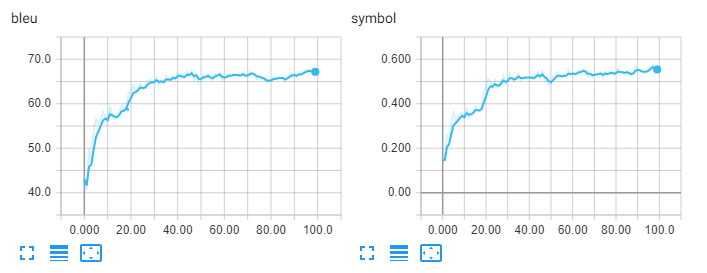

# Split-And-Recombine

This is the official code for our paper "A Split-and-Recombine Approach for Follow-up Query Analysis"(EMNLP2019).

In this paper, we propose to achieve context-dependent semantic parsing via performing follow-up query analysis, which aims to restate context-dependent natural language queries with contextual information. To accomplish the task, we propose the approach *Split-And-Recombine(StAR)*, a novel approach with a well-designed two-phase process. 

# Content
- [Setup](#setup)
- [Preprocess Data](#preprocess)
- [Training Arguments](#arguments)
- [Pretrain Model](#pretrain)
- [Train Model via Reinforcement Learning](#train)
- [Expected Result](#result)

# Setup

### Python Environment

First of all, you should setup a python environment. This code base has been tested under python 3.x, and we officially support python 3.7.

After installing python 3.7, we strongly recommend you to use `virtualenv` (a tool to create isolated Python environments) to manage the python environment. You could use following commands to create a environment.

```bash
python -m pip install virtualenv
virtualenv venv
```

### Activate Virutal Environment
Then you should activate the environment to install the dependencies. You could achieve it via using the command as below. (Please change $ENV_FOLDER to your own virtualenv folder path, e.g. venv)

```bash
$ENV_FOLDER\Scripts\activate.bat (Windows)
source $ENV_FOLDER/bin/activate (Linux)
```

### Install Dependencies

The main requirement of our code base is as following:

- allennlp == 0.8.2
- pytorch >= 0.4.0
- nltk >= 3.4.3

You could install them via `pip` commands. We recommend you to install `pytorch` first. You could follow this [guide](https://pytorch.org/get-started/locally/). Our code base can be trained on GPU/CPU as you like because the bottleneck is on computing the reward of reinforcement learning. If you want to speed up the training and you have enough CPU cores, you can manually modify the number of threads or make the reward collects from parallel processes at [here](https://github.com/microsoft/EMNLP2019-Split-And-Recombine/blob/95c11f97137d6592c27febe92f193055db3e119f/model/follow_up.py#L388).

Then you could install other dependencies by `requirements.txt`:

```bash
pip install -r requirements.txt
```


# Arguments

All command arguments are list as following:
```
usage: train_model.py [-h] [--learning_rate LEARNING_RATE] --store_folder
                      {pretrain,reinforce}
                      [--serialization_dir SERIALIZATION_DIR] [--seed SEED]
                      [--rl_basic RL_BASIC] --margin MARGIN
                      [--patience PATIENCE]
                      [--validation_metric {overall,symbol,bleu}]
                      [--epoch EPOCH]

Training the FollowUpSnippet Model

optional arguments:
  -h, --help            show this help message and exit
  --learning_rate LEARNING_RATE
                        learning rate for reinforcement learning or pretrain
  --training_mode {pretrain,reinforce}
                        Specify the training mode from pretrain or reinforce.
  --serialization_dir SERIALIZATION_DIR
                        The checkpoint folder which stores all training
                        states/model states and metrics.
  --seed SEED           The seed for reproducing the experiments.
  --rl_basic RL_BASIC   pretrained checkpoint dir for reinforcement
                        learning training
  --margin MARGIN       margin hyper-parameter for margin loss.
  --patience PATIENCE   patience of validation.
  --validation_metric {overall,symbol,bleu}
                        metric keeps the best model in validation.
  --epoch EPOCH         maximum training epochs
```


# Preprocess

Before the training, we should prepare the processed data using `preprocess.py`. The first run of preprocessing may be slow, but then the data will be cacahed into the `cache` folder. 

Note the script will automatically download data files from [FollowUp dataset](https://github.com/SivilTaram/FollowUp) and [glove pre-trained embedding](http://nlp.stanford.edu/data/glove.twitter.27B.zip).

```bash
python preprocess.py
```

Then you get the log as:

```log
Start to download FollowUp dataset from https://github.com/SivilTaram/FollowUp
Successfully unzip the FollowUp dataset and process it into `data_processed` and `data`.
Start to download Glove.twitter.27B from http://nlp.stanford.edu/data/glove.twitter.27B.zip
Start to unzip glove.zip to get the glove pre-training embedding.
Successfully unzip `glove.zip` into `glove` folder.
800it [00:03, 243.80it/s]
200it [00:00, 278.25it/s]
100%|██████████| 1000/1000 [00:00<00:00, 9142.40it/s]
```

# Pretrain

Once the data ready, we can train a pre-training model as stated in the paper using processed data `data_processed`. For windows users, you could replace `\ ` with `^` and it will work.

```bash
python train_model.py \
       --training_mode = pretrain \
       --learning_rate = 1e-3 \
       --margin = 0.3 \
       --epoch = 20 \
       --serialization_dir=split_and_recombine
```

# Train

Then we could train the Split-And-Recombine model. The training script will use the best model state in `pretrain` folder automatically. The default validation metric is `overall`, the average of symbol accuracy and bleu score.

```bash
python train_model.py \
       --training_mode = reinforce \
       --learning_rate = 1e-4 \
       --margin = 0.3 \
       --patience = 30 \
       --epoch = 80 \
       --rl_basic = split_and_recombine
```

# Result

Expected result is as stated in the paper, where BLEU is ~67.05(+-1.05) and Symbol Acc is ~54.00(+-1.09). The training will last ~6 hours on a `Tesla M40` GPU. We provide partial log information in `log.txt` for check. And the dev performance curve is as (the plot includes the result on pre-training):



# Cite

If you use the code, please consider citing our paper:

```
@inproceedings{qian2019star,
  title={A Split-and-Recombine Approach for Follow-up Query Analysis},
  author={Qian, Liu and Bei, Chen and Haoyan, Liu and Jian-Guang, Lou and Lei, Fang and Bin, Zhou and Dongmei, Zhang},
  booktitle={Proceedings of EMNLP},
  year={2019}
}
```
